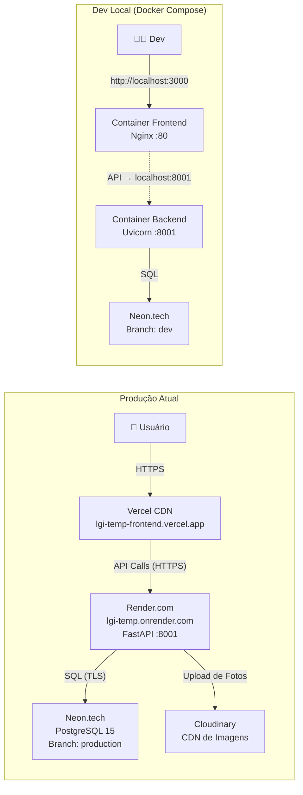

# Arquitetura do Sistema — Loop Frotas

Documento atualizado em 28/05/2026, com mapeamento detalhado da infraestrutura, ecossistema técnico, otimizações de performance e arquitetura de segurança Zero Trust. Fonte da Verdade do repositório `Cog2025/lgi-temp`.

---

## 1. Topologia do Sistema



### Resumo da Comunicação

| Camada | Tecnologia | Protocolo | Destino |
|--------|-----------|-----------|---------|
| Frontend → Backend | Axios (SPA) | HTTPS | `VITE_API_URL` (definido no build) |
| Backend → Banco | SQLAlchemy + psycopg2 | PostgreSQL (TLS) | `DATABASE_URL` |
| Backend → Cloudinary | SDK cloudinary | HTTPS | Fotos do Checklist |
| Monitoramento | Sentry SDK | HTTPS | Frontend + Backend (DSNs separados) |
| Health Check | UptimeRobot | HEAD `/ping` | Mantém o Render.com acordado |

---

## 2. Visão Geral da Arquitetura e Regras de Negócio

A plataforma **Loop Frotas** opera sob um modelo SPA (Single Page Application) no frontend, conectado a um backend monolítico modular. 

### Isolamento Multi-Tenant
- A arquitetura utiliza **Isolamento de Dados em Nível de Banco** implementado através da coluna `empresa_id` distribuída pelas tabelas (padrão *Tenant Tracking* via Foreign Key).
- As operações usam `current_user.empresa_atual_id`, extraído do token JWT no middleware (`auth.py`). Os Services injetam essa variável em todas as queries (SQLAlchemy) para impedir vazamento de dados entre empresas.

### Backend (Padrão Layered / DDD Tático)
- **Routers**: Localizados em `/routers`, contêm o mínimo de lógica. Injetam dependências (`Depends(get_db)`) e delegam os payloads.
- **Schemas (Pydantic)**: Em `/schemas`, a camada DTO valida as requisições de entrada (`Create`, `Req`) e formata os retornos (`Response`).
- **Services**: Em `/services`, a orquestração real acontece (CRUD, regras de negócios). O service interage com o banco de dados (`self.db`), isolando regras das rotas HTTP.

### Frontend (React SPA)
- Navegação assíncrona controlada via React Router na pasta `/pages/`.
- Estrutura componetizada: Grandes fluxos modais (ex: `ModalNovaSolicitacao.jsx`) isolados em `/components/`, separados por domínio (`/compras`, `/veiculos`).
- Os relatórios e PDFs complexos são montados inteiramente no Client-Side via `jspdf` em `/utils/`.

---

## 3. Banco de Dados (PostgreSQL e SQLAlchemy)

O sistema utiliza ORM **SQLAlchemy 2.0** conectado à **Neon.tech** (Serverless PostgreSQL).

### Estrutura de Branches (Neon.tech)
O projeto tira proveito de **Neon Branches** para isolar ambientes:
- **Branch `production`**: Dados reais, consumida exclusivamente pelo Render.com.
- **Branch `dev`**: Consumida via Docker local, assegurando que o desenvolvimento nunca interaja com dados reais.

### Modelagem
- `core.py`: Contém `Empresas`, `Bases` e o controle central de `AuditoriaLog`.
- Demais módulos (`compras.py`, `gastos.py`, `veiculos.py`): Fortemente acoplados a `empresas.id` e `usuarios.id` (criando o lastro de quem aprovou orçamentos, quem solicitou compras, etc).
- Relacionamentos configurados com suporte a *Lazy* e *Eager Loading* de entidades correlacionadas (ex: `OrdemCompra` ↔ `Fornecedor`).

### Resiliência de Conexão em Nuvem (Serverless Idle Timeout)

> [!TIP]
> **Trunfo de Infraestrutura:** Prevenção de quedas silenciosas por ociosidade (Evita o Erro 500).

Provedores de banco de dados *Serverless* modernos (como o Neon.tech) encerram conexões TCP/SSL ociosas de forma unilateral e agressiva para poupar recursos. Se a API tentar reutilizar uma conexão "morta" que estava guardada em memória, o sistema sofre um colapso repentino (Erro 500).

Para tornar o backend 100% resiliente a essas quedas, o motor do SQLAlchemy (`create_engine`) foi configurado com duas estratégias de auto-recuperação:
- **`pool_pre_ping=True` (Pessimistic Disconnect Handling)**: Realiza um micro-teste de latência (`SELECT 1`) em milissegundos antes de utilizar uma conexão da gaveta (pool). Se a porta do banco de dados estiver fechada, o SQLAlchemy descarta a conexão velha e abre uma nova silenciosamente, de forma totalmente transparente para o frontend.
- **`pool_recycle=300`**: Força a reciclagem proativa de qualquer conexão que permaneça aberta por mais de 5 minutos na memória, renovando-as antes que o provedor em nuvem as considere abandonadas.

---

## 4. Diagnóstico do Frontend (Vercel)

| Arquivo | Conteúdo | Status |
|---------|----------|--------|
| `vercel.json` | Rewrite catch-all `/(.*) → /index.html` | ✅ Correto para SPA |
| `vite.config.js` | Apenas `plugins: [react()]`, sem proxy | ✅ Limpo |
| `package.json` | Vite 7.x, React 19.x | ✅ Atualizado |

### Resolução de API
A base URL (no arquivo `api.js`) prioriza a variável injetada no build:
1. `import.meta.env.VITE_API_URL` (Na Vercel: `https://lgi-temp.onrender.com`).
2. Fallback local: `http://localhost:8001`.

---

## 5. Diagnóstico do Backend (FastAPI)

### Stack e Ambiente
- **Framework**: FastAPI (0.115.6) + Uvicorn (0.34.0).
- **Hospedagem**: Render.com (`https://lgi-temp.onrender.com`). Web Service auto-deploy integrado à branch `main`.
- **Startup**: `alembic upgrade head && python run.py`.

### Docker: Estado de Prontidão
A stack local está 100% pronta. O arquivo `docker-compose.yml` orquestra três serviços (`db`, `backend`, `frontend`). O `docker-compose.override.yml` injeta variáveis locais para hot-reload e portas estáticas.

---

## 6. CI/CD e Integrações

### CI/CD
> [!IMPORTANT]
> **Não existem Github Actions configuradas.**
> O deploy é zero-config e automático:
> - **Frontend**: Push na branch `main` engatilha build nativo da **Vercel**.
> - **Backend**: Push na branch `main` engatilha build nativo no **Render.com**.

### Serviços Externos
- **Sentry**: Rastreamento de erros (`VITE_SENTRY_DSN` e `SENTRY_DSN`).
- **Cloudinary**: Hospedagem otimizada de mídias (`CLOUDINARY_URL`).
- **OpenRouteService**: Rotas e geolocalização da frota (`ORS_API_KEY`).

---

## 7. Mapeamento de Variáveis de Ambiente

### Backend (Produção — Render.com)
| Variável | Obrigatória | Exemplo | Descrição |
|----------|:-----------:|---------|-----------| 
| `DATABASE_URL` | ✅ | `postgresql://...` | Connection string do Neon.tech |
| `SECRET_KEY` | ✅ | `Qm5Zr...` | Assinatura JWT |
| `FIRST_SUPERUSER` | ✅ | `admin@loop.com` | Credencial raiz |

### Frontend (Produção — Vercel)
| Variável | Obrigatória | Exemplo | Descrição |
|----------|:-----------:|---------|-----------| 
| `VITE_API_URL` | ✅ | `https://lgi-temp.onrender.com` | Endereço do FastAPI |

> [!NOTE]
> Os arquivos locais `.env` estão devidamente incluídos no `.gitignore`. Nenhum segredo vaza no código-fonte.

---

## 8. Performance e Otimização de Cache

> [!TIP]
> **Status: ✅ RESOLVIDO.** O gargalo de performance por "Massive Data Fetching" em abas (Mount/Unmount destrutivo do React) foi completamente mitigado.

### Solução Implementada

O problema de chamadas excessivas à API foi resolvido com a adoção de duas estratégias complementares:

1. **TanStack React Query (`useQuery`)**: Toda a camada de fetching de dados do frontend foi migrada do padrão `useEffect` + `useState` nativo para o hook `useQuery` da biblioteca `@tanstack/react-query`. Isso proporciona:
   - **Cache em memória**: Quando uma aba é destruída e recriada, o `useQuery` intercepta a requisição e devolve os dados instantaneamente da RAM, sem bater na API.
   - **Stale Time configurável**: Dados permanecem "frescos" por um período definido (`staleTime: 1000 * 60 * 5`), evitando refetches desnecessários.
   - **Invalidação cirúrgica via `queryClient.invalidateQueries`**: Após operações de mutação (POST, PUT, DELETE), o cache da query específica é invalidado e atualizado automaticamente, mantendo a UI em sincronia com o banco.

2. **Hook `usePersistedTab`**: Para telas com múltiplas abas (ex: `Compras.jsx`, `Veiculos.jsx`, `Colaboradores.jsx`), o hook customizado persiste a aba ativa no `sessionStorage`. Quando o usuário navega entre telas e retorna, a aba é restaurada automaticamente, eliminando a sensação de "resetar" a tela.

---

## 9. Arquitetura de Segurança e RBAC (Zero Trust)

A plataforma implementa um modelo de segurança **Zero Trust** em duas camadas (Frontend + Backend), baseado em uma **Matriz de Permissões Granular** controlada por Slugs.

### 9.1. Matriz de Permissões (Slugs Granulares)

Cada ação sensível do sistema é mapeada para um **slug de permissão** único, organizado hierarquicamente por módulo e verbo:

```
┌─────────────────────────────────┐
│  Módulo        │  Slug          │
├─────────────────────────────────┤
│  Gastos        │  gastos.criar  │
│                │  gastos.editar │
│                │  gastos.excluir│
│                │  gastos.baixar │
├─────────────────────────────────┤
│  Compras (SC)  │  compras.sc.criar   │
│                │  compras.sc.editar  │
│                │  compras.sc.excluir │
├─────────────────────────────────┤
│  Compras (OC)  │  compras.oc.criar   │
│                │  compras.oc.receber │
├─────────────────────────────────┤
│  Compras (Orç.)│  compras.orcamentos.criar   │
│                │  compras.orcamentos.aprovar │
│                │  compras.orcamentos.excluir │
├─────────────────────────────────┤
│  Estoque       │  estoque.cadastrar   │
│                │  estoque.movimentar  │
│                │  estoque.editar      │
│                │  estoque.excluir     │
├─────────────────────────────────┤
│  Veículos      │  veiculos.criar  │
│                │  veiculos.editar │
│                │  veiculos.excluir│
├─────────────────────────────────┤
│  Colaboradores │  colaboradores.criar  │
│                │  colaboradores.editar │
│                │  colaboradores.excluir│
├─────────────────────────────────┤
│  Bases         │  bases.gerenciar     │
└─────────────────────────────────┘
```

Os slugs são registrados no banco de dados via a função `setup_inicial` em `app/routers/permissoes.py`. A tela de administração (`AdminPermissoes.jsx`) permite que o administrador ative ou desative cada slug individualmente por cargo (Role), usando toggles visuais.

### 9.2. Blindagem no Frontend (UI Toggles)

O hook customizado `useCan()` (localizado em `frontend/src/hooks/useCan.js`) fornece uma função `can(slug)` que consulta as permissões do usuário logado:

```javascript
// Hook de Autorização
const can = useCan();

// Ocultação condicional de botões destrutivos
{can('gastos.excluir') && (
    <button onClick={() => handleDelete(id)}>
        <Trash2 size={18} /> Excluir
    </button>
)}
```

**Regra de Bypass**: Usuários com cargo `admin` ou `superadmin` recebem **passe livre** automático (`return true`), sem necessidade de verificar slugs individualmente.

**Cobertura**: O hook foi aplicado nos módulos de Gastos, Compras, Estoque, Veículos, Colaboradores, Motoristas e Bases, envelopando todos os botões de criação, edição, exclusão e exportação.

### 9.3. Blindagem Absoluta no Backend (API Guard)

A função `verificar_permissao(slug, current_user, db)` (localizada em `app/permissions.py`) é injetada como primeira instrução nas rotas sensíveis do FastAPI:

```python
@router.post("/sc", response_model=schemas.SolicitacaoCompraResponse)
def criar_sc(sc: schemas.SolicitacaoCompraCreate, db: Session = Depends(get_db), current_user = Depends(auth.get_current_user)):
    verificar_permissao("compras.sc.criar", current_user, db)
    return ComprasService(db, current_user.empresa_atual_id).criar_sc(sc, current_user.id)
```

**Comportamento**: Se o usuário não possui o slug exigido, a função levanta um `HTTPException(403, detail="Sem permissão")` imediatamente, **antes** de qualquer lógica de negócio ser executada.

### 9.4. Mitigação de Ataques

| Vetor de Ataque | Descrição | Mitigação |
|-----------------|-----------|-----------|
| **Ataque Vertical (Shadow Actions)** | Usuário tenta executar ações sensíveis (POST, PUT, DELETE) diretamente via API, mesmo sem o botão visível na interface. | `verificar_permissao` bloqueia na camada de rota, independentemente da UI. |
| **Ataque Horizontal (Vazamento de Dados)** | Usuário tenta exportar PDFs, Excel ou relatórios de módulos aos quais não tem acesso de download. | Slugs de download (`gastos.baixar`, `compras.baixar`, `estoque.baixar`, `checklists.baixar`, `relatorios.baixar`) protegem endpoints de exportação. |
| **Escalação de Privilégio** | Usuário tenta acessar a tela de permissões ou restaurar padrões do sistema. | A tela `AdminPermissoes.jsx` é restrita. O botão "Restaurar Padrões" é visível apenas para `user?.is_superadmin`. |

### 9.5. Segregação de Funções (Separation of Duties)

A granularidade dos slugs permite **segregação real de responsabilidades**:
- Quem cria uma Ordem de Compra (`compras.oc.criar`) **não necessariamente** pode confirmar seu recebimento (`compras.oc.receber`).
- Quem cria orçamentos (`compras.orcamentos.criar`) **não necessariamente** pode aprová-los (`compras.orcamentos.aprovar`).
- Quem cadastra itens no estoque (`estoque.cadastrar`) **não necessariamente** pode movimentá-los (`estoque.movimentar`).

Essa divisão impede que um único operador controle todo o ciclo de vida de uma transação financeira, reforçando o princípio de **Least Privilege** (Menor Privilégio).

---

## 10. Resumo Executivo

| Aspecto | Estado | Nota |
|---------|--------|------|
| **Frontend Hosting** | ✅ Operacional | Vercel auto-deploy integrado. |
| **Backend Hosting** | ✅ Operacional | Render.com web-service integrado. |
| **Banco de Dados** | ✅ Seguro | Neon.tech isolando Produção e Desenvolvimento por Branches. |
| **Docker Local** | ✅ Pronto | 3 containers (nginx, uvicorn, db) mapeados para pleno desenvolvimento. |
| **Segurança de Env** | ✅ Blindado | Nenhum segredo exposto no GIT. |
| **Arquitetura (Backend)** | ✅ Escalável | Padrão DDD tático e schemas Pydantic fornecem sólida validação. |
| **Performance (Frontend)** | ✅ Otimizado | Cache em memória via TanStack React Query. Hook `usePersistedTab` persiste abas ativas. Chamadas excessivas à API eliminadas. |
| **Segurança RBAC** | ✅ Nível Enterprise (Zero Trust) | Matriz granular de slugs. Blindagem dupla (Frontend `useCan` + Backend `verificar_permissao`). Segregação de Funções ativa. |
